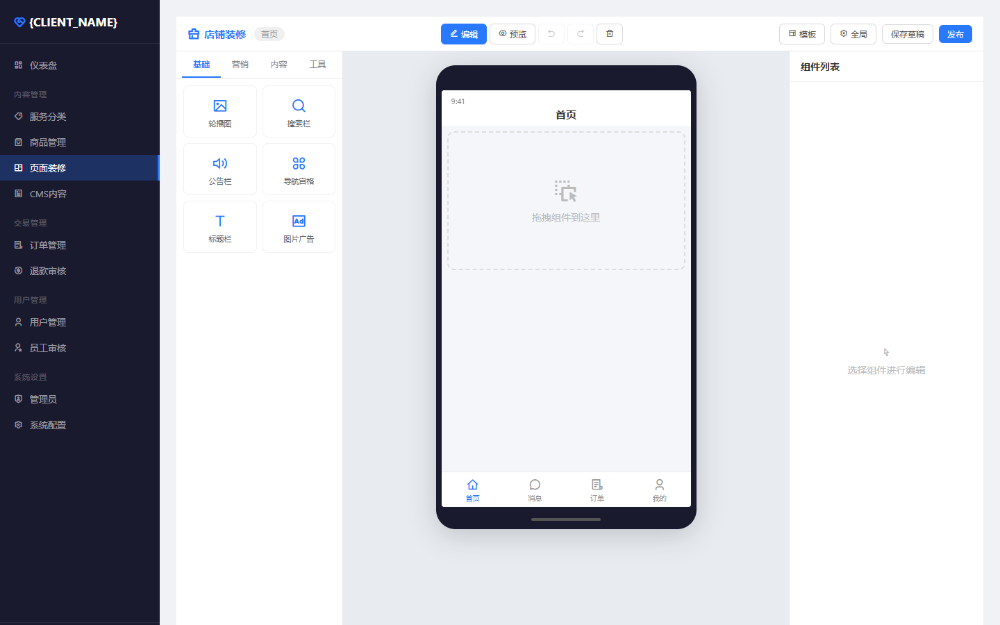
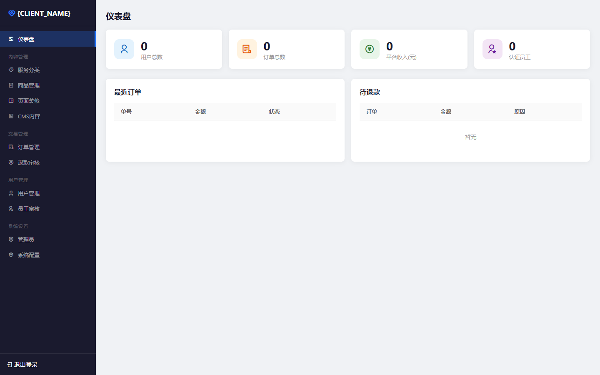
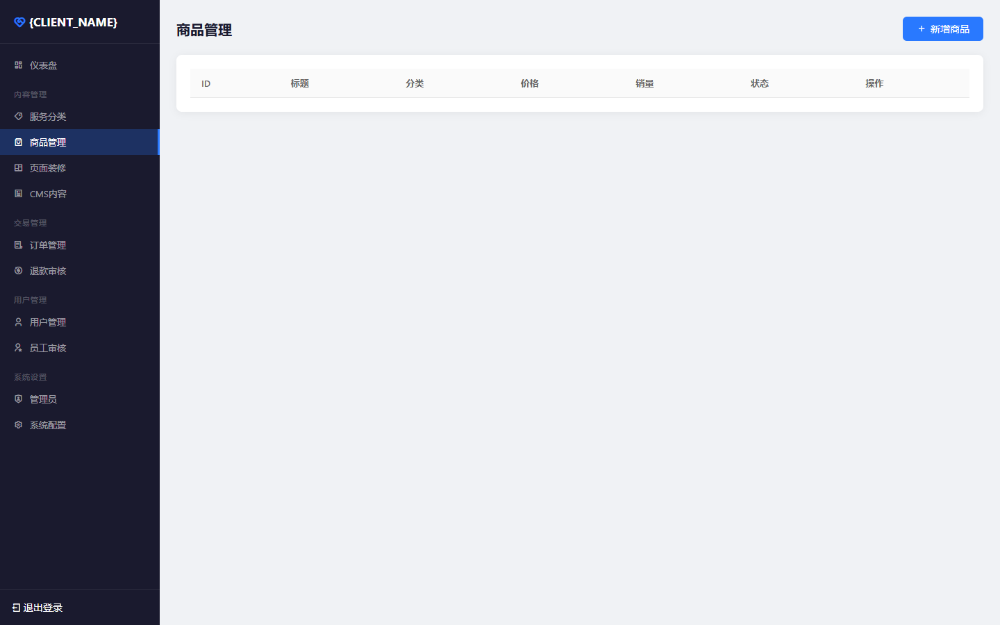
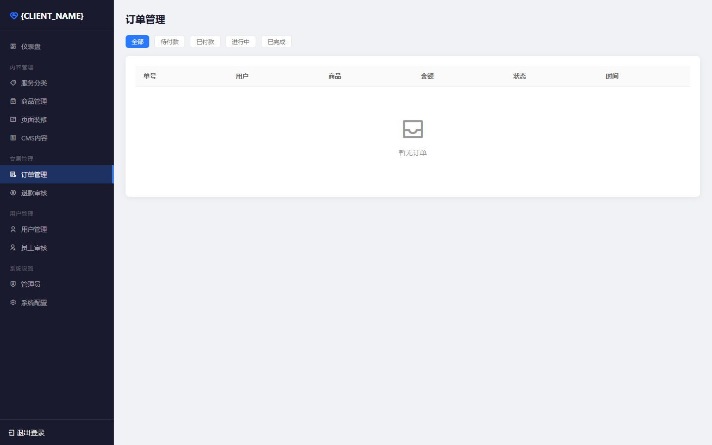

# 🛠️ 自主接单平台

> 通用任务服务平台 — 管理员上架商品，用户购买下单，员工接单处理，完整的 O2O 服务闭环。

[](LICENSE)
[](https://vuejs.org)
[](https://nestjs.com)
[](https://uniapp.dcloud.net.cn)

---

## 📸 项目截图

### 🎨 可视化店铺装修编辑器


> 拖拽式 DIY 首页编辑器，17种组件类型，4套预设模板，实时预览，撤销/重做，一键发布。

### 📊 数据仪表盘


### 🛒 商品管理


### 📋 订单管理


---

## ✨ 核心功能

### 用户端（微信小程序）
- 🏠 **首页展示** — 可视化装修的首页，轮播图/导航/商品推荐
- 🔍 **商品浏览** — 分类筛选，服务详情，价格透明
- 💰 **在线下单** — 微信支付，订单实时追踪
- 💬 **内置聊天** — 与接单者实时 IM 沟通
- ⭐ **评价系统** — 完成后双方互评打分
- 🔙 **退款申请** — 未完成前可申请退款

### 接单者端
- 📋 **任务池** — 实时浏览/抢单
- ✅ **认证审核** — 手机号 + 实名认证 + 保证金
- 💼 **接单中心** — 订单管理、收入统计
- ⭐ **信誉体系** — 评分、完成率展示

### 管理后台
- 📊 **数据仪表盘** — 核心指标可视化（ECharts）
- 🛒 **商品管理** — 分类/商品 CRUD，上下架
- 📋 **订单管理** — 全流程追踪，状态流转
- 👷 **员工审核** — 接单者资质审核
- 💵 **退款审核** — 退款申请处理
- 📝 **CMS 内容** — 文章/公告管理
- 🎨 **店铺装修** — 拖拽式可视化首页编辑器
- ⚙️ **系统配置** — 抽佣比例、保证金等参数

---

## 🏗️ 技术架构

```
┌─────────────────────────────────────────────────────────┐
│                    微信小程序 (uni-app)                    │
│                  Vue3 + Pinia + RemixIcon                 │
└──────────────────────┬──────────────────────────────────┘
                       │ HTTPS / WebSocket
┌──────────────────────┴──────────────────────────────────┐
│                   Nginx (反向代理 + SSL)                  │
└──────────────────────┬──────────────────────────────────┘
                       │
┌──────────────────────┴──────────────────────────────────┐
│                  NestJS 后端服务 (Port 3001)               │
│  Auth │ User │ Product │ Order │ Chat │ Payment │ ...    │
│                 TypeORM + MySQL / SQLite                  │
└─────────────────────────────────────────────────────────┘
                       │
┌──────────────────────┴──────────────────────────────────┐
│              Vue3 管理后台 (Vite + Pinia)                  │
│          Dashboard │ Products │ Orders │ Builder          │
└─────────────────────────────────────────────────────────┘
```

### 技术栈明细

| 层级 | 技术选型 | 说明 |
|------|---------|------|
| 小程序前端 | uni-app (Vue3) | 一套代码多端运行 |
| 管理后台 | Vue3 + Vite + Pinia | 现代化 SPA |
| 图表 | ECharts + vue-echarts | 数据可视化 |
| 图标 | RemixIcon | 2000+ 开源图标 |
| 后端框架 | NestJS 10.x | 企业级 Node.js 框架 |
| ORM | TypeORM 0.3 | 支持 MySQL / SQLite |
| 实时通信 | Socket.IO | WebSocket 聊天 |
| 认证 | JWT + Passport | 无状态认证 |
| 数据库 | MySQL 8.0 / SQLite | 生产/开发切换 |
| 部署 | Docker / PM2 + Nginx | 容器化部署 |

---

## 🚀 快速开始

### 环境要求

- Node.js >= 18
- MySQL 8.0（生产环境）或使用 SQLite（开发环境）
- 微信小程序 AppID（小程序端）

### 本地开发

```bash
# 1. 克隆
git clone https://github.com/yourname/task-platform.git
cd task-platform

# 2. 后端
cd server
cp .env.example .env    # 编辑配置
npm install
npm run build
npm run start:prod      # http://localhost:3001

# 3. 管理后台
cd ../admin
npm install
npm run dev             # http://localhost:5173

# 4. 小程序
# 用 HBuilderX 打开 mini-program/ 目录运行
```

### 默认管理员

| 项目 | 值 |
|------|-----|
| 地址 | http://localhost:5173/login |
| 账号 | admin |
| 密码 | admin123 |

### Docker 部署

```bash
docker-compose up -d
# MySQL + NestJS + Nginx 一键启动
```

---

## 📁 项目结构

```
task-platform/
├── mini-program/            # uni-app 小程序源码
│   ├── pages/               # 4个主Tab页面
│   ├── subpkg/               # 分包（商品/订单/聊天/员工）
│   ├── components/           # 公共组件
│   ├── api/                  # API 请求封装
│   ├── store/                # Pinia 状态管理
│   └── static/               # 图标/图片资源
├── admin/                   # Vue3 管理后台
│   └── src/
│       ├── views/            # 15个页面
│       │   ├── Dashboard.vue         # 仪表盘
│       │   ├── PageBuilder.vue       # 店铺装修编辑器 ⭐
│       │   ├── Products.vue          # 商品管理
│       │   ├── Orders.vue            # 订单管理
│       │   ├── Employees.vue         # 员工审核
│       │   └── ...
│       ├── components/       # CompRenderer / PropsEditor
│       ├── api/              # Axios 封装
│       └── router/           # 路由配置
├── server/                  # NestJS 后端
│   └── src/modules/
│       ├── auth/             # 微信登录 + 管理员登录
│       ├── user/             # 用户管理
│       ├── product/          # 商品管理
│       ├── order/            # 订单系统（含状态机）
│       ├── employee/         # 接单者认证
│       ├── chat/             # WebSocket 即时通讯
│       ├── payment/          # 微信支付集成
│       ├── refund/           # 退款审核
│       ├── page-config/      # 页面装修配置
│       └── cms/              # 内容管理
├── docker-compose.yml       # Docker 编排
├── nginx.conf               # Nginx 配置
├── init.sql                 # 数据库初始化
└── deploy.sh                # 一键部署
```

---

## 📱 微信小程序配置

1. 登录 [微信公众平台](https://mp.weixin.qq.com)
2. **开发管理 → 服务器域名** 配置：
   - request 合法域名: `https://你的域名`
   - uploadFile 合法域名: `https://你的域名`
   - socket 合法域名: `wss://你的域名`
3. 配置微信支付商户号
4. 订阅消息模板（订单状态变更通知）

---

## 🔄 订单状态流转

```
下单 → 已支付 → 已接单 → 服务中 → 已完成 → 已评价
  ↓                ↓        ↓
取消            退款中 → 已退款
```

---

## 📄 License

MIT © 2024 Task Platform
